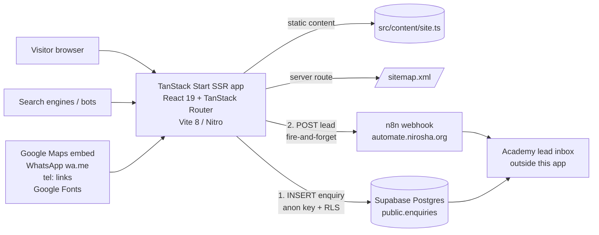
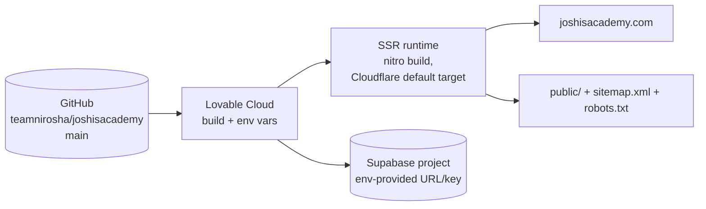

# Architecture — Joshis Academy Website

Documented from actual code. Where a layer exists only as scaffolding, that is stated explicitly.

## System Architecture (actual)

The application is a **server-rendered marketing website** whose "backend" responsibilities are shared between a TanStack Start SSR layer, direct browser-to-Supabase persistence, and an external n8n webhook.



This reflects the real data flow: **no custom REST API between frontend and a self-hosted backend exists**. Enquiry submission goes straight from the browser to Supabase and n8n.

## Frontend Architecture

- **Routing:** file-based TanStack Router routes in `src/routes/` (`src/routes/README.md` documents conventions). Route tree auto-generated into `src/routeTree.gen.ts` — never edit by hand.
- **Root layout:** `src/routes/__root.tsx` — document head (meta/SEO/fonts/favicons/JSON-LD), `SiteShell` wrapper, QueryClientProvider, not-found and error components.
- **Global chrome:** `src/components/site-shell.tsx` — announcement bar (configurable, expiry-aware), sticky compact header, desktop nav, full-screen mobile menu, footer (map embed + links), mobile fixed bottom action bar (Call | WhatsApp | Enquire), and the shared Enquiry dialog. Content below header is padded by `announcementHeight + 72px` (non-home pages).
- **Pages:** routes are self-contained compositions of sections (mostly inline JSX), sharing `PageHero` (`src/components/page-hero.tsx`) for inner-page heroes, `seoMeta()` for head tags, and `Crumbs` breadcrumbs.
- **Homepage** (`src/routes/index.tsx`) is the richest page with interactive sections: approach accordion/tabs, rotating testimonial, method stepper — all client state (`useState`), no data fetching.
- **UI primitives:** shadcn/ui-style components under `src/components/ui/` (Radix-based). Only `ui/button.tsx` is imported by application code; `@radix-ui/react-dialog` is used directly by the enquiry dialog. All other `ui/*` files are unused scaffold.
- **Content module:** `src/content/site.ts` exports typed data (`CourseItem`, courses, approach, scienceDisciplines, methodology, results, testimonials, facultyStandards, faqs, galleryItems, articles, site, announcement). No CMS; edits are code edits.

## Backend Architecture

- **SSR entry wrapper:** `src/server.ts` — lazily imports `@tanstack/react-start/server-entry`, calls it as a fetch handler, and normalizes catastrophic responses. Because h3 (the underlying server) swallows in-handler throws into `{"unhandled":true,"message":"HTTPError"}`, `normalizeCatastrophicSsrResponse` re-writes such 500s into a styled HTML error page and logs the original error recovered via `src/lib/error-capture.ts`.
- **Start configuration:** `src/start.ts` — `createStart` registers:
  - `attachSupabaseAuth` as **function middleware** (client side: attaches the Supabase session bearer token to serverFn RPCs — harmless today because no serverFn calls exist),
  - `errorMiddleware` (request-level try/catch → HTML error page), and
  - `createCsrfMiddleware` for `serverFn` handlers (protects any future server functions from cross-site requests).
- **Server route:** `/sitemap.xml` handled via `server.handlers.GET` in `src/routes/sitemap[.]xml.tsx` — no dynamic database content.
- **Server-only Supabase clients** (`client.server.ts` service-role client, `auth-middleware.ts` bearer verification, `cron-auth.ts` shared-secret guard) exist as generated infrastructure but are **referenced nowhere in application code**.

## API Layer

There is no application-owned HTTP API. Interfaces that exist:

1. **Supabase PostgREST** — used implicitly by `supabase.from("enquiries").insert(...)` from the browser (publishable key; RLS limits to INSERT).
2. **n8n webhook** — `POST https://automate.nirosha.org/webhook/joshisacademy` (JSON payload), fire-and-forget from the browser.
3. **Static assets & routes** served by the SSR layer.

See `ai/API_CONTRACTS.md` for full payload details.

## Authentication Layer

- **Not user-facing.** No login/registration/session UI exists.
- Client Supabase instance (`src/integrations/supabase/client.ts`) is configured with auth persistence (`persistSession`, `autoRefreshToken`, preview-brokered storage) because the template enables it, but no page calls `supabase.auth.*`.
- `attachSupabaseAuth` global middleware would attach a session token if one existed.
- Server scaffolding (`requireSupabaseAuth`) verifies Bearer JWTs for hypothetical authenticated server functions — unused.
- See `ai/AUTHENTICATION.md`.

## Database Layer

- Supabase Postgres, project configured in `supabase/config.toml` (`project_id` present; no local stack config in repo besides it).
- Single migration creates `public.enquiries` + grants + RLS + trigger + index. See `ai/DATA_MODEL.md`.
- Typed via generated-style `src/integrations/supabase/types.ts` (`Database` type with one table).
- The app never *reads* the table in code; reads happen outside the application (dashboard / n8n).

## Module Dependencies (important relationships found in code)

```mermaid
flowchart TD
    root[__root.tsx] --> shell[site-shell.tsx]
    shell --> enquiry[enquiry-dialog.tsx]
    shell --> loader[brand-loader.tsx]
    shell --> btn[ui/button.tsx]
    enquiry --> sb[integrations/supabase/client.ts]
    enquiry --> content[content/site.ts]
    enquiry --> RDIALOG[radix dialog]
    index[/index.tsx/] --> content
    index --> assets[assets/*.jpg]
    index --> btn
    courses-dir[/courses.index.tsx/] --> content + page-hero
    course-detail[/courses.$slug.tsx/] --> content + page-hero
    journal* --> content + page-hero
    other pages about/faculty/results/faq/gallery/contact/privacy/terms --> content + page-hero + btn
    sitemap[/sitemap.xml/] --> content
    router[router.tsx] --> routeTree.gen.ts
    start[start.ts] --> auth-attacher.ts
    server[server.ts] --> error-capture.ts + error-page.ts
    styles[styles.css] --> tailwind v4
```

Notes on dependencies:

- `page-hero.tsx` is used by ~12 route files (PageHero/Crumbs/seoMeta) — highest-leverage shared component.
- `content/site.ts` is imported by nearly every route; it is the single content source.
- Only 3 photographs exist and are reused across sections: `classroom-hero.jpg`, `academy-approach.jpg`, `classroom-wide.jpg`.
- `use-mobile.tsx` is only referenced by unused `ui/sidebar.tsx`.
- `page-transition.tsx` + `dual-ring-spinner.tsx` are **dead code** (unused after the overlay was removed in commit `0290926`).
- TanStack Query (`QueryClient`) is provisioned but unused by any route (no `useQuery`/loader query calls).
- Server-only Supabase modules (`client.server.ts`, `auth-middleware.ts`, `cron-auth.ts`) are unreferenced outside `src/integrations/supabase/`.

## Request Lifecycle

```mermaid
sequenceDiagram
    participant B as Browser
    participant R as TanStack Start SSR (server.ts entry)
    participant RT as Router + route loader
    participant SB as Supabase
    participant N as n8n

    B->>R: GET /courses/cbse-class-10-science
    R->>RT: render route (root head meta/SEO + SiteShell)
    RT->>RT: course loader reads content/site.ts
    R-->>B: HTML (fonts, CSS, JSON-LD)
    B->>B: hydration, client router takes over
    B->>B: 3s timer opens Enquiry dialog
    B->>SB: supabase.from("enquiries").insert({...})  [anon + RLS]
    SB-->>B: inserted row / error (degraded to success UI)
    B->>N: POST webhook/joshisacademy (fire-and-forget)
    N-->>B: (ignored; failures only console.warn)
```

## External Integrations

- **Supabase** — persistence; browser client w/ publishable key + RLS insert policy. Service-role key exists server-side but unused.
- **n8n** at `automate.nirosha.org` — real-time lead forwarding; failure is non-fatal by design (`.catch(console.warn)`).
- **Google Maps** — embed iframe (`site.mapsEmbed`) and directions link (`site.mapsUrl`).
- **WhatsApp** — `https://wa.me/<digits>` links built from `site.whatsapp`.
- **tel:** links from `site.phone`.
- **Google Fonts** — Manrope / DM Serif Display.
- **Lovable platform** — build config provider (`@lovable.dev/vite-tanstack-config`), env-var injection ("Lovable Cloud"), editor telemetry hooks (`lib/lovable-error-reporting.ts`), preview auth broker.
- **Search engines** — sitemap.xml, robots.txt, canonical links, JSON-LD.
- Full detail in `ai/INTEGRATIONS.md`.

## Deployment Architecture



Evidence basis: canonical/OG/JSON-LD URLs point to `https://joshisacademy.com`; `vite.config.ts` is `@lovable.dev/vite-tanstack-config` (nitro, Cloudflare default target, `.wrangler`/`.dev.vars` gitignored); error strings instruct to connect services in "Lovable Cloud". Exact hosting provider / dashboards are **UNKNOWN — Requires confirmation** (nothing inside the repo declares the deploy target). See `ai/DEPLOYMENT.md`.

## Architecture Boundaries

| Layer | Responsibility | Must not do |
|-------|----------------|-------------|
| Routes (`src/routes/`) | Compose pages from shared components + content; define per-route SEO; hold page-local UI state | Fetch remote data ad hoc; contain business logic beyond the page |
| Global chrome (`SiteShell`) | Header, announcement, nav, footer, mobile bar, dialogs, layout offsets | Page-specific logic |
| Content module (`site.ts`) | Single typed source of marketing content | Talk to services; change frequently outside content edits |
| Supabase integration (`src/integrations/supabase/`) | Client creation, env handling, types, auth plumbing | Imported into browser UI except the thin client |
| SSR plumbing (`server.ts`, `start.ts`, `lib/*`) | Error resilience (h3 swallow workaround), CSRF, friendly error pages | Application features |
| Supabase DB | Persist `enquiries` with RLS guardrails | — |
| n8n | Receive + forward leads outside the app | — |

## Important Dependency Relationships

- `@lovable.dev/vite-tanstack-config` centralizes the Vite/TanStack/Tailwind/Nitro configuration. `vite.config.ts` must NOT duplicate its plugins (comment warning in file). The only override added: `ssr.noExternal: ["recharts"]` (fixes `useContext` null SSR error; recharts is currently only used by the unused `ui/chart.tsx`).
- `recharts` pinned via package.json `overrides.rolldown = 1.2.1` and `@rolldown/binding-win32-x64-msvc` optional dep — Windows build environment.
- TypeScript path alias `@/*` → `./src/*` used throughout.
- Node ≥ `types: ["vite/client"]`; tsconfig has no test types configured.
