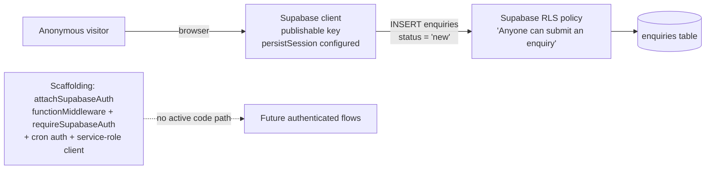

# Authentication — Joshis Academy Website

## Executive Summary

**There is no user-facing authentication.** The public site has no login, registration, account, or session concept. Visitors browse anonymously and submit enquiries as the anonymous Supabase role. What *does* exist is Supabase auth **plumbing** inherited from the project template — some of it registered globally — that no application flow actually exercises.

## Login Flow

**NOT IMPLEMENTED.** No login page, no `supabase.auth.signInWithPassword` / OAuth calls, no protected routes.

## Registration Flow

**NOT IMPLEMENTED.** No sign-up anywhere.

## Token / Session Mechanism

- `src/integrations/supabase/client.ts` (browser): creates the Supabase client with `persistSession: true`, `autoRefreshToken: true`, and a special `brokeredPreviewStorage()` storage adapter.
- `brokeredPreviewStorage` (`previewAuthStorage.ts`): on Lovable preview hosts, auth tokens are brokered to the editor via `postMessage` (only to validated Lovable editor origins) so preview surfaces share one login; elsewhere it falls back to `localStorage`. This exists so *if* an auth session existed, preview iframes would share it — no session currently exists in practice.
- Session would be persisted in `localStorage` (key managed by supabase-js) in normal deployments, or brokered in Lovable previews.

## JWT

- JWT would be Supabase's standard access token (only *referenced* by the unused `auth-middleware.ts`, which validates `header.payload.signature` shape, 3 segments, and verifies claims via `supabase.auth.getClaims(token)`).
- **No JWT secret handling** exists in application code. Supabase JWTs are verified server-side by Supabase itself; the middleware (unused) only forwards the user token.

## Refresh Token

- `autoRefreshToken: true` on the client instance, but unused in practice (no sessions).
- No manual refresh handling anywhere.

## Session Handling

- No `onAuthStateChange` listeners, no session UI, no sign-out flow.
- `src/integrations/supabase/auth-attacher.ts`: global **function middleware** registered in `src/start.ts` (`functionMiddleware: [attachSupabaseAuth]`) — on the client it reads `supabase.auth.getSession()` and, if a token exists, attaches `Authorization: Bearer <token>` to TanStack Start serverFn RPCs. With no sessions, it sends no header. Harmless today; it would matter only if authenticated server functions are added.
- `previewAuthStorage` logout tombstone: `''` value removes local copy (broker bookkeeping only).

## Password Handling

**N/A** — no passwords collected, stored, or processed by the application. (Enquiry form collects a parent *name* and *mobile number*, not credentials.)

## Roles

- **`anon`** — the role every visitor uses. RLS allows anonymous **INSERT** into `enquiries` (policy `"Anyone can submit an enquiry"`, `WITH CHECK (status = 'new')`).
- **`authenticated`** — also granted the same insert policy; no authentication flow creates such users.
- **`service_role`** — full privileges via server client (`client.server.ts`), **unused** by any code path.

## Permissions

| Action | anon | authenticated | service_role |
|--------|------|---------------|--------------|
| INSERT `enquiries` (status='new') | ✅ RLS | ✅ RLS | ✅ (bypasses RLS) |
| SELECT/UPDATE/DELETE `enquiries` | ❌ RLS denies | ❌ RLS denies | ✅ |
| Anything else in app | n/a | n/a | n/a |

No application-level role/permission model exists.

## Protected Routes

**None.** All routes are public. The CSRF middleware (`start.ts`) protects server functions (not routes) — relevant only when server functions are added.

## Frontend Auth State

- None. No auth context/provider in the React tree. `QueryClientProvider` is the only global provider (plus the router context).
- The only "state" resembling sessions: `sessionStorage["ja_seen_loader"]` (brand loader once-per-session flag) — unrelated to authentication.

## Backend Security Filters / Configuration

- `src/start.ts` — `createCsrfMiddleware({ filter: ctx => ctx.handlerType === "serverFn" })`: blocks cross-site requests to server functions.
- `src/start.ts` — error middleware wrapping server functions/routes.
- `src/server.ts` — SSR fetch entry that wraps the whole request and normalizes catastrophic errors.
- `requireSupabaseAuth` (`auth-middleware.ts`) — would sit on server functions to verify `Authorization: Bearer <supabase JWT>`; **registered nowhere** (unused).
- `authenticateCronRequest` (`cron-auth.ts`) — SHA-256/timing-safe comparison against `LOVABLE_CRON_SECRET` / `LOVABLE_CRON_SECRET_PREVIOUS` for hypothetical cron endpoints; **unused**.

## Actual Data Flow (as implemented today)

## Documented Facts vs. Common Misconceptions

- ❌ "The site has Supabase auth users" — no signup/login exists; `auth` tables may exist in the hosted project automatically but the app never uses them.
- ❌ "Service-role key is used somewhere" — only constructed lazily by the unused `client.server.ts`; nothing imports it.
- ✅ Enquiry submission relies on **RLS insert-only**, not authentication.
- ✅ Anyone with network access can INSERT a row shaped like an enquiry (subject to DB CHECKs and the honeypot's limited protection) — an accepted, deliberate trade-off for a public lead form.

## UNKNOWN — Requires Confirmation

- Whether any future admin panel is planned and which auth strategy it would use (Supabase email/password, OAuth, etc.).
- Whether Supabase Auth has users/providers enabled in the hosted project dashboard (outside repo scope).
