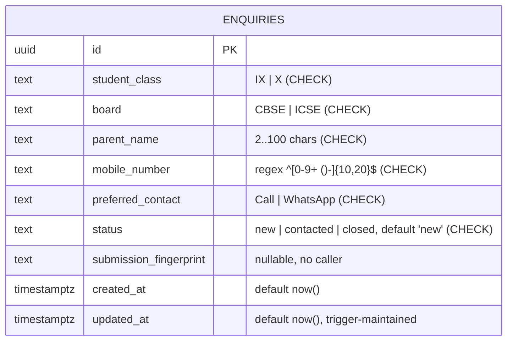

# Data Model — Joshis Academy Website

Source of truth: `supabase/migrations/20260904045430_2fbcfcb4-b594-4dfb-9238-6c2edc9459ef.sql` and `src/integrations/supabase/types.ts` (they agree).

The schema is minimal: **one table** (`public.enquiries`). No views, functions, enums, or composite types are defined in the migration, and none appear in the generated client types (`Views`/`Functions`/`Enums`/`CompositeTypes` are all empty).

## Table: `public.enquiries`

Represents one counselling/enquiry lead submitted via the website enquiry dialog.

| Column | Type | Nullable | Default | Constraints / Notes |
|--------|------|----------|---------|---------------------|
| `id` | `uuid` | no | `gen_random_uuid()` | **Primary key** |
| `student_class` | `text` | no | — | `CHECK (student_class IN ('IX','X'))` |
| `board` | `text` | no | — | `CHECK (board IN ('CBSE','ICSE'))` |
| `parent_name` | `text` | no | — | `CHECK (char_length(parent_name) BETWEEN 2 AND 100)` |
| `mobile_number` | `text` | no | — | `CHECK (mobile_number ~ '^[0-9+ ()-]{10,20}$')` |
| `preferred_contact` | `text` | no | — | `CHECK (preferred_contact IN ('Call','WhatsApp'))` |
| `status` | `text` | no | `'new'` | `CHECK (status IN ('new','contacted','closed'))` — lead workflow state (schema-only; nothing in the app updates it) |
| `submission_fingerprint` | `text` | **yes** | — | Intended spam/duplicate fingerprinting; **never populated by the app** (no field in the insert payload) |
| `created_at` | `timestamptz` | no | `now()` | |
| `updated_at` | `timestamptz` | no | `now()` | Maintained by trigger `enquiries_set_updated_at` (function `public.set_updated_at`) on UPDATE |

## Primary / Foreign Keys

- **Primary key:** `enquiries.id` (uuid, client- or server-generated).
- **Foreign keys:** none — the table has no relationships (`Relationships: []` in types).

## Indexes

- `enquiries_created_at_idx` on `(created_at DESC)` — supports newest-first queries (currently unused by the app).

## Constraints Summary

- 6 CHECK constraints (see table above) encode the business rules (class, board, contact method, name length, mobile format, status enum-like values).
- Status values `new | contacted | closed` are enforced by CHECK, not a Postgres enum type.

## Triggers & Functions

- Function `public.set_updated_at()` (plpgsql, `search_path = public`) sets `NEW.updated_at = now()`.
- Trigger `enquiries_set_updated_at` — `BEFORE UPDATE ON public.enquiries FOR EACH ROW`.

## RLS / Grants

- `GRANT INSERT ON public.enquiries TO anon, authenticated;`
- `GRANT ALL ON public.enquiries TO service_role;`
- `ALTER TABLE ... ENABLE ROW LEVEL SECURITY;`
- Policy `"Anyone can submit an enquiry"`: `FOR INSERT TO anon, authenticated WITH CHECK (status = 'new')` — an insert can only create rows in the `new` state.
- **Reads are not permitted** for `anon`/`authenticated` under RLS — the application intentionally has no read path.

## DTO / Client-Type Relationship

- `src/integrations/supabase/types.ts` defines `Database.public.Tables.enquiries` with `Row`, `Insert`, `Update` shapes mirroring the migration (types list `board`, `created_at`, `id`, `mobile_number`, `parent_name`, `preferred_contact`, `status`, `student_class`, `submission_fingerprint`, `updated_at` as strings/nullables).
- The frontend does **not** define a formal DTO for enquiries; `enquiry-dialog.tsx` builds an inline `FormData` (camelCase) and a snake_case insert payload. Note the payload extras (`email`, `submitted_at`, `page_url`) do **not** map to DB columns — they exist only for the n8n webhook payload (see `API_CONTRACTS.md`).

## Application Data NOT in the Database

All marketing content (courses, articles, FAQs, results stats, testimonials, faculty standards, gallery metadata, site contact info, announcement) lives in TypeScript at `src/content/site.ts` (plus route-local gallery items in `gallery.tsx`). There is no content table.

## UNKNOWN — Requires Confirmation

- Whether the hosted Supabase project contains additional tables/objects created outside migrations (e.g., auth schema objects created automatically by Supabase). The migration file is the only schema the repo knows about.
- Whether the n8n workflow persists its own copy of the lead (outside this database).
