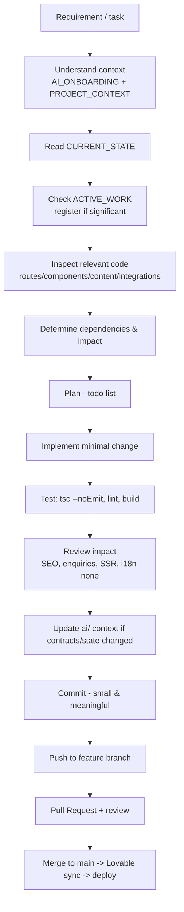

# Development Workflow — Joshis Academy Website

Recommended AI-assisted workflow for this repository. Follow it for every task, no matter how small it looks.



## Step Details

1. **Requirement** — clarify scope. If ambiguous, ask; never assume.
2. **Understand context** — read `ai/AI_ONBOARDING.md`, `ai/PROJECT_CONTEXT.md`.
3. **Read CURRENT_STATE** — know what is actually implemented before touching anything.
4. **Check ACTIVE_WORK** — if another developer/agent claims the area, coordinate (or register your task row in `ai/ACTIVE_WORK.md`).
5. **Inspect relevant code** — follow the dependency map in `ARCHITECTURE.md`; read the actual files (route, component, content entry, integration).
6. **Determine dependencies & impact** — content module consumers, route tree, SEO artifacts, Supabase schema, webhook payloads, env vars, Lovable sync.
7. **Plan** — maintain a visible todo list for multi-step work.
8. **Implement** — minimal, scoped changes. Respect rules in `AI_RULES.md` (no unrelated fixes, reuse components, no new deps unless justified).
9. **Test** — no automated tests exist, so run:
   - `npx tsc --noEmit` (typecheck; never emit)
   - `npm run lint` (eslint + prettier)
   - `npm run build` (production build incl. SSR) for behaviour-affecting changes
   - `npm run dev` for manual/visual verification when UI changes
10. **Review impact** — did you touch shared chrome, the enquiry flow, SEO head, content data shape, or env handling? Double-check consumers.
11. **Update context** — if you changed architecture, contracts, features, or state, update the relevant `ai/*.md` + `ai/CHANGELOG.md` so the next agent sees reality.
12. **Commit** — small, meaningful commits; never commit secrets; never rewrite pushed history (Lovable).
13. **Push** — to a feature branch (see `GIT_WORKFLOW.md`). Note: pushing to `main` directly syncs to Lovable and can trigger production deploy — be deliberate.
14. **PR → review → merge** — keep `main` stable.

## Environment Setup (for humans/AI shells)

```bash
git clone https://github.com/teamnirosha/joshisacademy.git
cd joshisacademy
npm i        # README uses npm; bun.lock also present
npm run dev  # local dev server (Vite/TanStack Start)
```

Environment variables are **not** committed and are supplied by Lovable Cloud in deployed environments. For local runs against real Supabase, set:

- `VITE_SUPABASE_URL` and `VITE_SUPABASE_PUBLISHABLE_KEY` (client; also read from `process.env.SUPABASE_URL`/`SUPABASE_PUBLISHABLE_KEY` in SSR)
- server-only: `SUPABASE_SERVICE_ROLE_KEY` (unused by app code), `LOVABLE_CRON_SECRET` / `LOVABLE_CRON_SECRET_PREVIOUS` (unused)

Without them, importing the Supabase client throws ("Missing Supabase environment variable(s)..."). Secrets stay out of the repo — see `SECURITY.md`.

## Getting Started Checklist for a New Task

- [ ] Read AI_ONBOARDING + AI_RULES
- [ ] Confirm current branch and `git status` is clean(ish) before starting
- [ ] Pull latest `main`
- [ ] Check ACTIVE_WORK for collisions
- [ ] Read the specific page/component you will change + its data source
- [ ] State the plan + impact before editing
- [ ] Validate with tsc/lint/build
- [ ] Update context docs + CHANGELOG if scope changed
